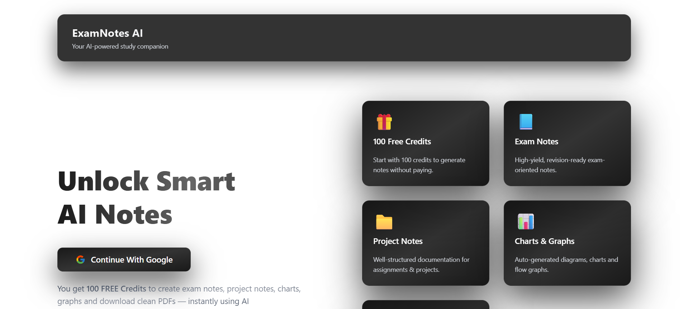
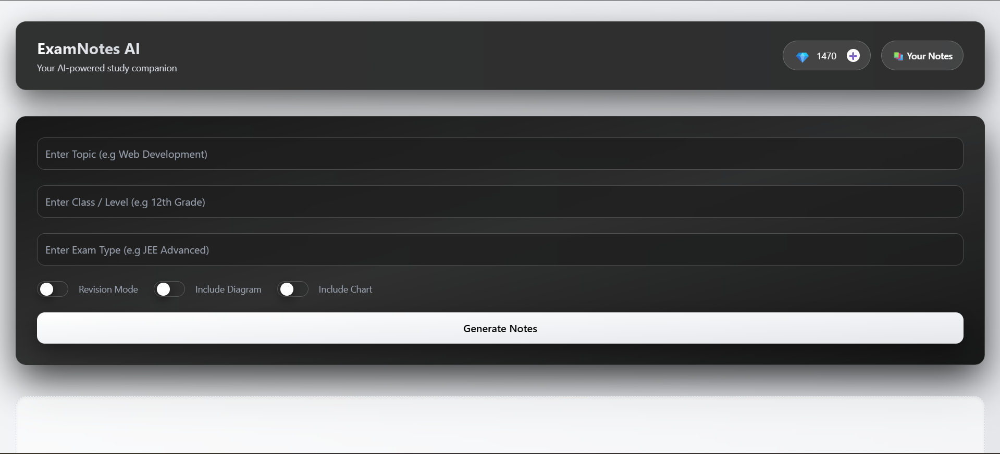
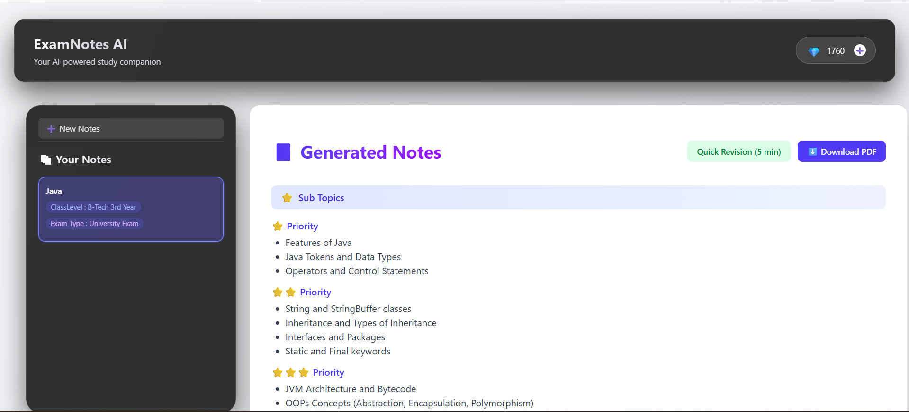
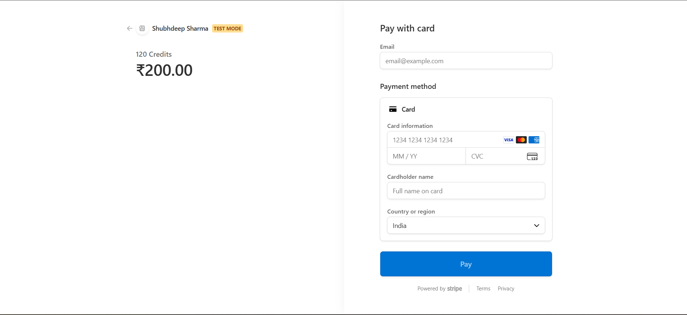

# 📚 ExamNotesAI


**ExamNotesAI** is an AI-powered platform that helps students quickly generate **structured exam notes from PDFs and study material**.

Download PDF notes, let AI process the content, and receive **clear, concise notes optimized for exam preparation**.

The platform also includes a **credit-based payment system using Stripe**, allowing users to purchase credits for generating notes.

---

# 🌐 Live Demo

🚀 Try the application here:

🔗 **Live App:**  
https://examnotesaiclient-2jcj.onrender.com/

🧪 **Test Payment (Stripe Test Mode)**

```
Card Number: 4000 0035 6000 0008
Expiry Date: Any future date
CVC: Any 3 digits
```
---
# 📸 Demo Screenshots

| Homepage | Generate Notes |
|----------|----------------|
|  |  |

| Generated Notes | Stripe Checkout |
|-----------------|----------------|
|  |  |


---

# 🚀 Features

✨ AI-powered exam notes generation  
📄 Download generated notes as PDF  
🧠 Smart summarization and key concept extraction  
🎯 Interview Prep Notes
📝 Generate quizes
💳 Credit-based usage system  
💰 Stripe payment integration  
🔐 Google authentication  
📂 Manage generated notes  
⚡ Fast backend processing

---

# 🖥️ Tech Stack

## Frontend
- React
- Vite
- Tailwind CSS
- Axios

## Backend
- Node.js
- Express.js
- MongoDB
- Mongoose

## Authentication
- Google OAuth

## Payments
- Stripe Checkout
- Stripe Webhooks

## AI Processing
- Gemini AI API

---

# 🏗️ Architecture

```
User
  ↓
React Frontend
  ↓
Express Backend API
  ↓
MongoDB Database
  ↓
Gemini AI API
  ↓
Stripe Payments
```

---

# 📂 Project Structure

```
ExamNotesAI
│
├── client
│   ├── src
│   ├── components
│   ├── pages
│   └── utils
│
├── server
│   ├── controllers
│   ├── routes
│   ├── models
│   ├── middleware
│   ├── utils
│   └── server.js
|
├── screenshots
│   ├── homepage.png
│   ├── generate-notes.png
│   ├── notes.png
│   ├── payment.png
│   └── download.png
|
└── README.md
```

---

# ⚙️ Installation

## 1️⃣ Clone the repository

```bash
git clone https://github.com/shubhdeep123/ExamNotesAI.git
cd ExamNotesAI
```

---

## 2️⃣ Install dependencies

### Backend

```bash
cd server
npm install
```

### Frontend

```bash
cd client
npm install
```

---

# 3️⃣ Setup Environment Variables

Create a `.env` file inside the **server folder**.

```env
PORT=8000

MONGO_URI=your_mongodb_connection_string

JWT_SECRET=your_secret_key

CLIENT_URL=http://localhost:5173

STRIPE_SECRET_KEY=your_stripe_secret_key
STRIPE_WEBHOOK_SECRET=your_webhook_secret

GOOGLE_CLIENT_ID=your_google_client_id
GOOGLE_CLIENT_SECRET=your_google_client_secret
```

---

# ▶️ Running the Project

### Start backend

```bash
cd server
npm run dev
```

### Start frontend

```bash
cd client
npm run dev
```

Application will run at:

```
Frontend: http://localhost:5173
Backend: http://localhost:8000
```

---

# 💳 Stripe Webhook Setup

Stripe webhooks securely confirm payments before adding credits.

### Install Stripe CLI

https://stripe.com/docs/stripe-cli

### Login

```bash
stripe login
```

### Forward events to your local server

```bash
stripe listen --forward-to localhost:8000/api/credits/webhook
```

Add the webhook secret to `.env`:

```
STRIPE_WEBHOOK_SECRET=whsec_xxxxxxxx
```

---

# 🔑 Credit System

The platform uses a **credit-based model**.

```
User purchases credits
        ↓
Stripe Checkout
        ↓
Stripe Webhook verifies payment
        ↓
Credits added to user's account
```

This ensures **secure payment verification before granting credits**.

---

# 📌 API Routes

## Authentication

```
POST /api/auth/google
GET  /api/auth/logout
```

---

## User

```
GET /api/user/currentuser
```

---

## Notes

```
GET /api/getnotes
POST /api/generate-notes
GET /api/notes/:id
```

---

## PDF Processing

```
POST /api/pdf/generate-pdf
```

---

## Credits

```
POST /api/credits/order
POST /api/credits/webhook
```

---

# 🚀 Deployment

Frontend: Render  
Backend: Render  
Database: MongoDB Atlas  

Live Demo:

https://examnotesaiclient-2jcj.onrender.com/

---

# 🧠 Future Improvements

- AI flashcards generation
- Quiz creation from notes
- Study planner
- Collaborative note sharing
- Mobile app version

---

# 👨‍💻 Author

**Shubhdeep Sharma**

GitHub  
https://github.com/shubhdeep123

---

# ⭐ Contributing

Contributions are welcome!

1. Fork the repository  
2. Create a new branch  
3. Commit changes  
4. Open a Pull Request  

---

⭐ If you like this project, consider giving it a star on GitHub!
